# Aura Gui
Aura gui is a dark gui texture pack inspired by the [Aura Theme Color Palette](https://github.com/daltonmenezes/aura-theme/tree/main/packages/color-palettes)  
based around simple and transparent inventories.   (transparency may require optifine or [Transparent](https://www.curseforge.com/minecraft/mc-mods/transparent) (Fabric), and background blur thanks to [Blur](https://www.curseforge.com/minecraft/mc-mods/blur-fabric))

## Config
The config with some nice initial setting including theming, mod popup removal, and camera settings to reduce motion   sickness are in the config directory which can be pasted into the `.minecraft` folder to take effect.

## Multimc Theme
A multimc theme is in this folder for matching to the Aura Gui resource pack, the contents can be pasted into `multimc/themes/custom/`

## Screenshots
Main Menu
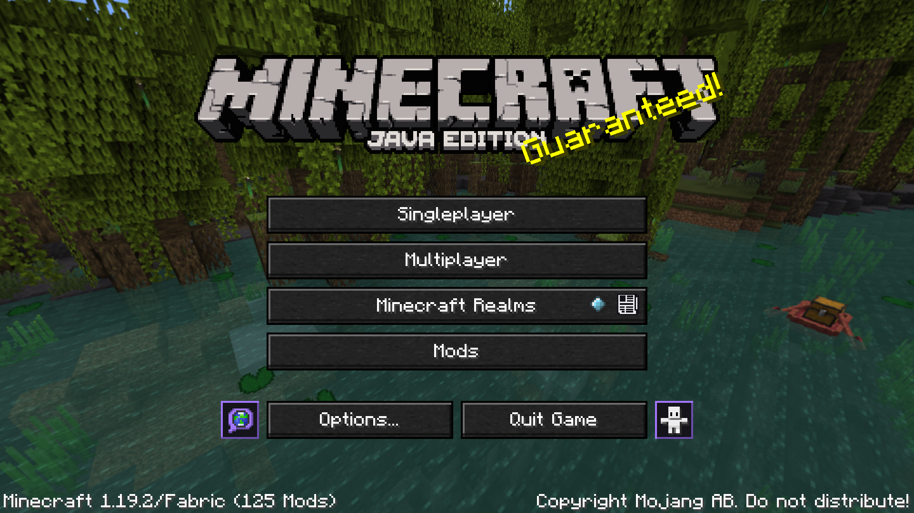
In game menu
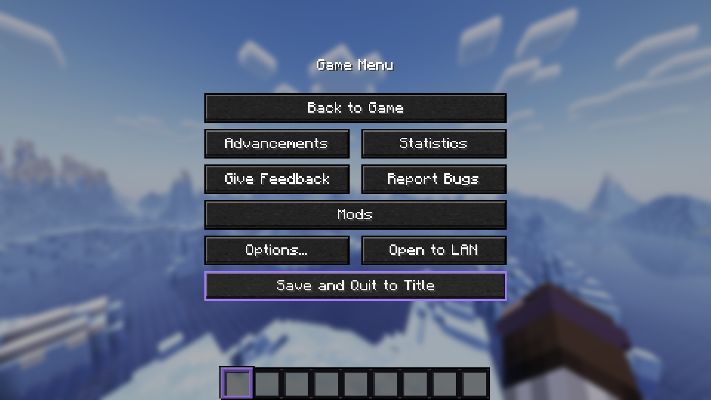
Options
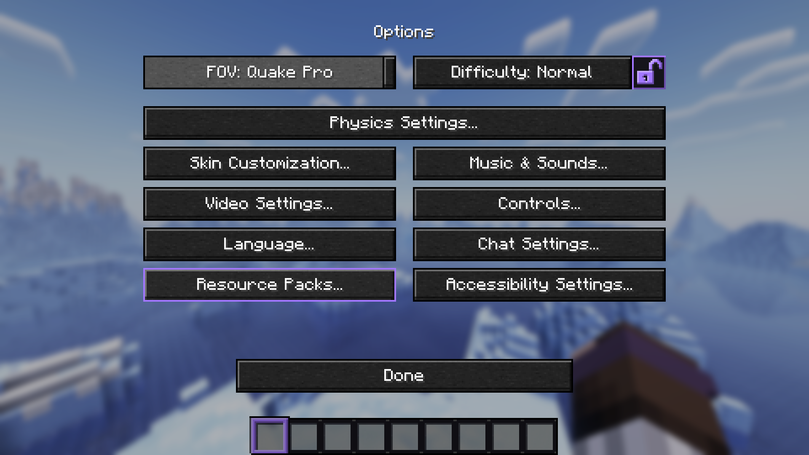
Creative
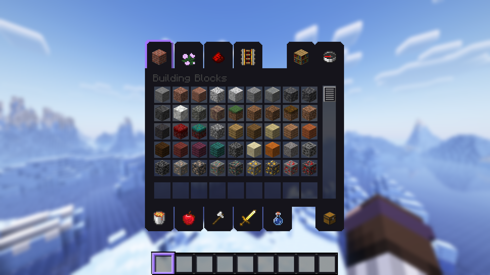
Creative Inventory
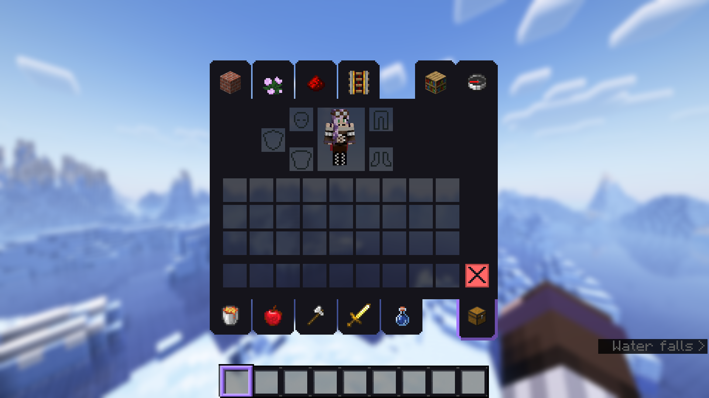
Accessability
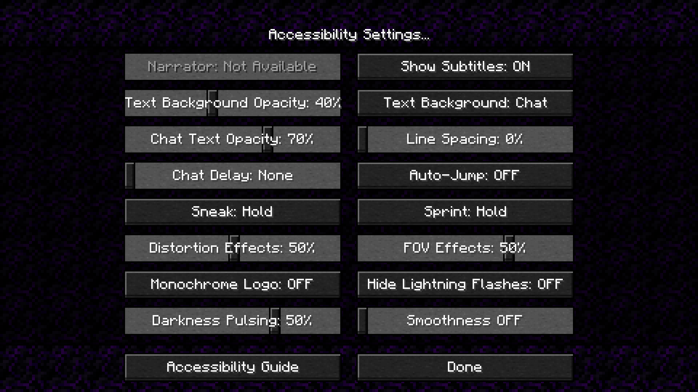
Crafting
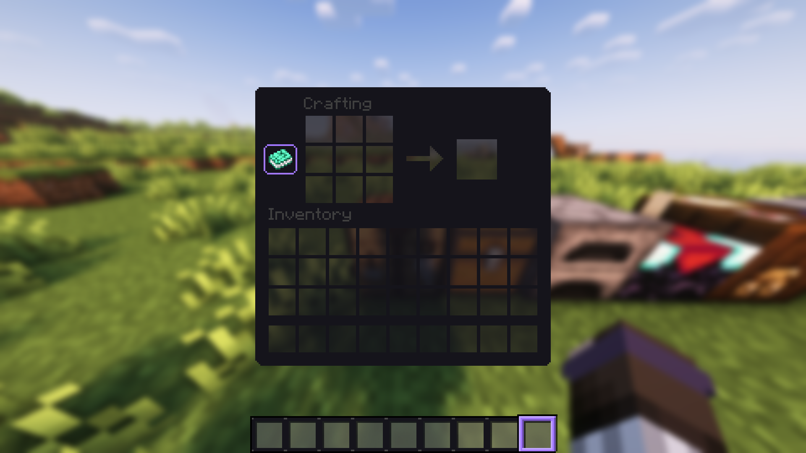
Chest
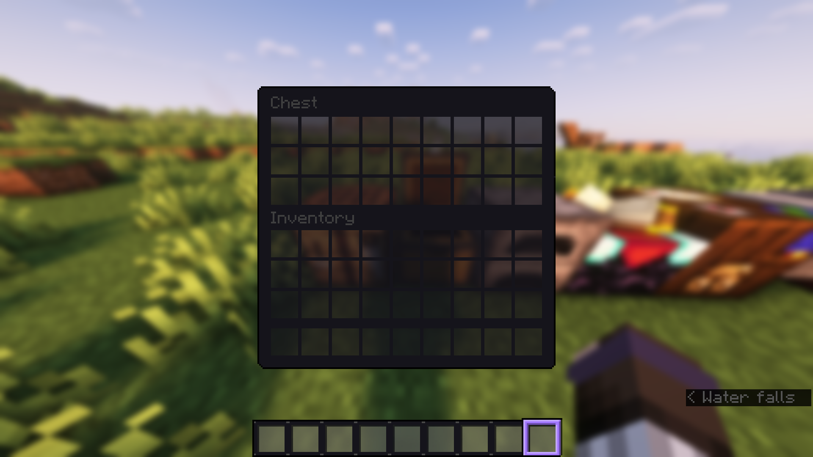
Furnace
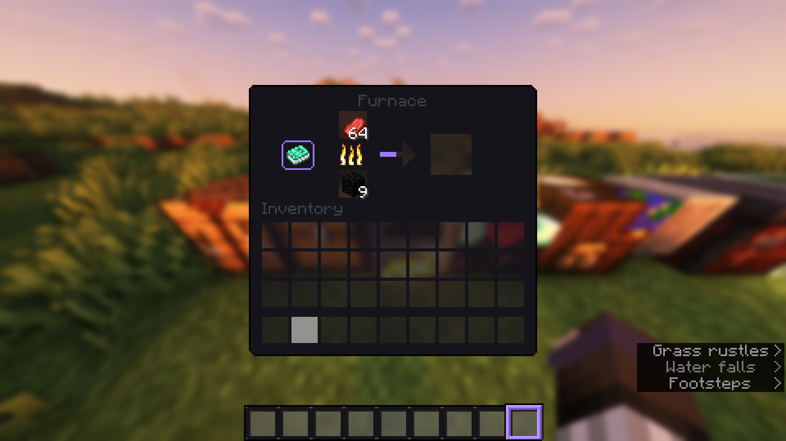
Enchanting
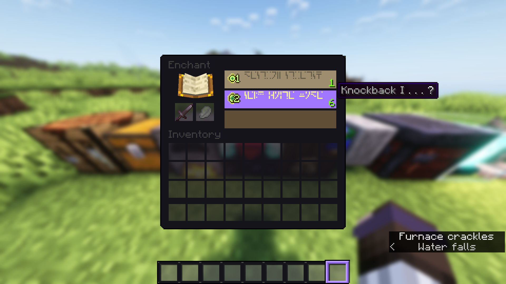
Cartography
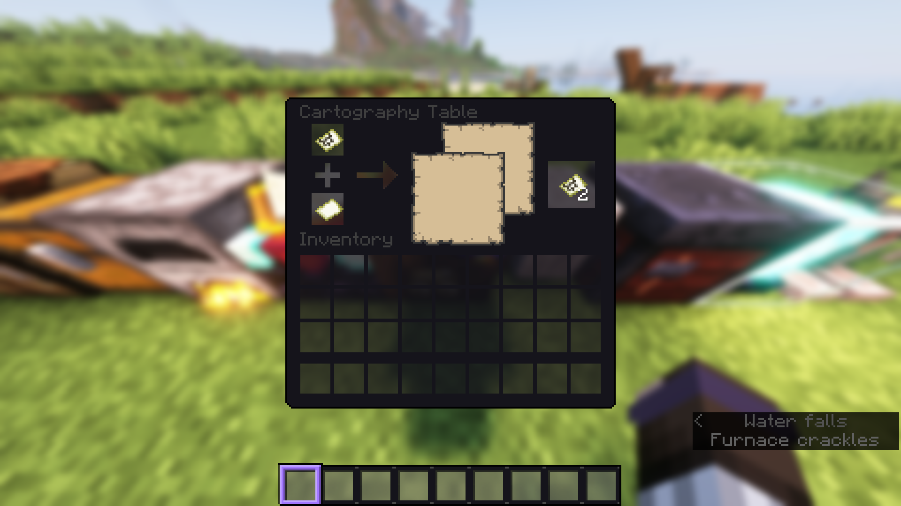
Grindstone
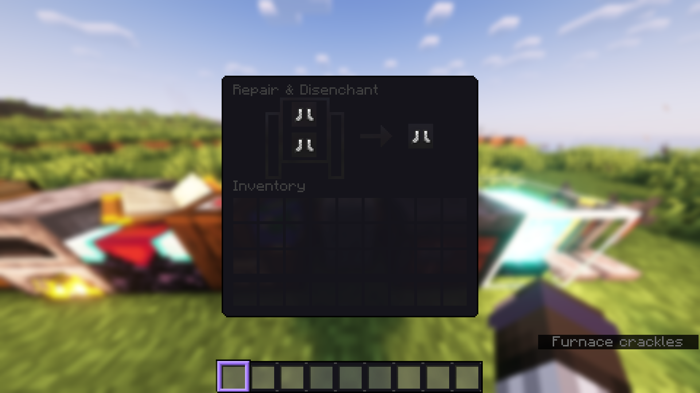
Smithing Table
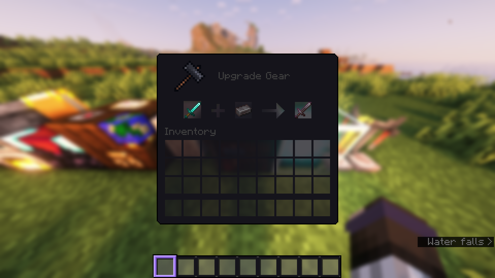
Beacon
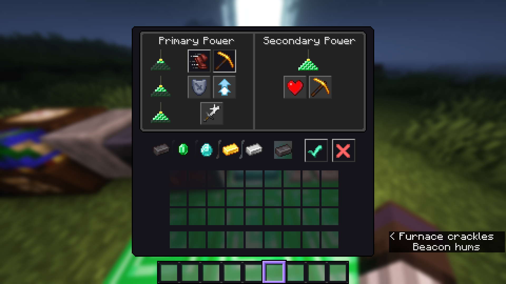
Brewing Stand
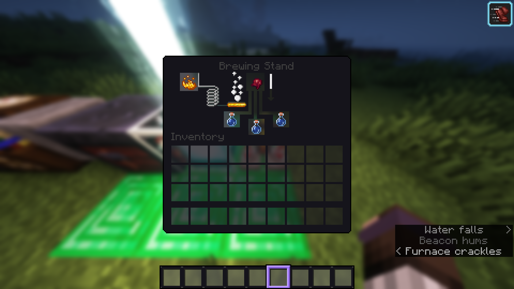